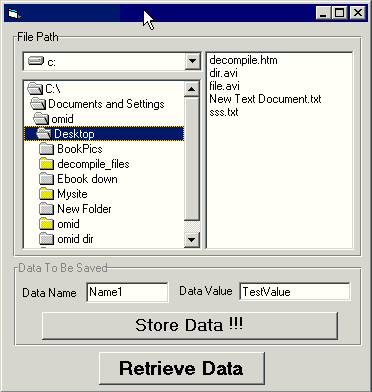



## Writing data in a file without any file Content/Size/Attributes changes \(NO FILE\-CHANGES AT ALL\)\!\!\!

### Description

This program uses NTFS streams to save data in a hidden place of files. So your data is saved without any file-changes like size,attributes,contents or .... everything is like before you save data. It can be used to prevent file monitoring utilities like InCtrl5 or ... to track your file activities. YOU CAN SAVE & RETRIVE WITHOUT ANY CHANGE IN FILES. Pure VB code (No API or ..)
 
### More Info
 

             |
---                |---
**Submitted On**   |2004-10-04 20:20:58
**By**             |[Omid G\.L\.](https://github.com/Planet-Source-Code/PSCIndex/blob/master/ByAuthor/omid-g-l.md)
**Level**          |Intermediate
**User Rating**    |5.0 (30 globes from 6 users)
**Compatibility**  |VB 5\.0, VB 6\.0
**Category**       |[Files/ File Controls/ Input/ Output](https://github.com/Planet-Source-Code/PSCIndex/blob/master/ByCategory/files-file-controls-input-output__1-3.md)
**World**          |[Visual Basic](https://github.com/Planet-Source-Code/PSCIndex/blob/master/ByWorld/visual-basic.md)
**Archive File**   |[Writing\_da1801071042004\.zip](https://github.com/Planet-Source-Code/omid-g-l-writing-data-in-a-file-without-any-file-content-size-attributes-changes-no-file-c__1-56531/archive/master.zip)

